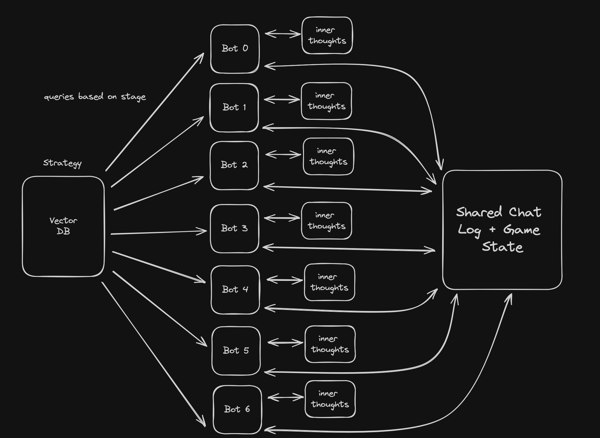

# What We Did
We made LLMs play the popular deception game Secret Hitler.

# How We Did It
1. Passed in relevant information to each player: Their known information (board state, fascists if they are a fascist, etc.)
2. Chunked and uploaded strategy docs to a vector database and pull relevant strategy using RAG
3. The rules of the stage and their goal
4. Gave a history of the discussions between players (discussed before voting and after enacting a policy)

# Tech Stack

# Credits
Secret Hitler Simulator We Built On: https://github.com/Mycleung/Secret-Hitler

Strategy Docs: https://secrethitler.tartanllama.xyz/
